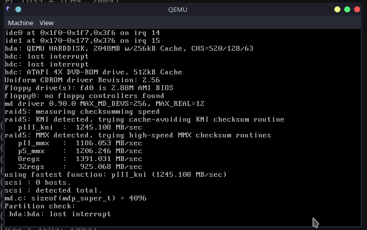
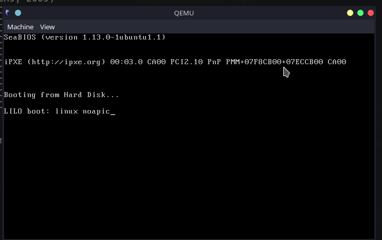
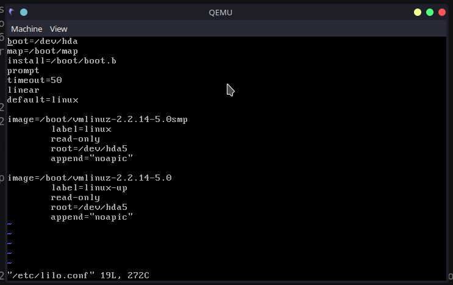
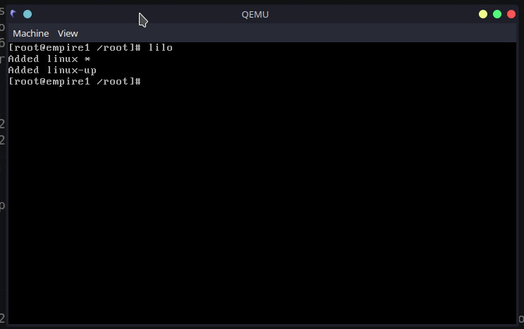

# Red Hat 6.2 Notes

Important to note: I created this solution to experiment on old server software, not for GUI/Desktop use. I found the graphics to be severely broken when using the desktop, especially the fonts, and therefore I recommend doing everything in text mode only.

Assuming you have cloned this repository and the project directory is your current `$PWD`, you can follow the below instructions or modify to suite your needs.

## Prepare images directory and hard drive

Run:

```shell
mkdir images

./create_hdd_drive.sh $PWD/images/c_rh62
```

Also copy the RedHat 6.2 ISO to `$PWD/images/zoot-i386.iso`

Alternative, update the `install_redhat62.sh` and `launch_redhat62.sh` files to suite your needs.

The `$PWD/images/` directory now looks like this:

```shell
$ ls $PWD/images/
total 641M
drwxrwxr-x 4 user user 4.0K Jul 24 08:47 ..
-rw-rw-r-- 1 user user 641M Jul 24 08:50 zoot-i386.iso
-rw-r--r-- 1 user user 2.0G Jul 24 08:51 c_rh62.img
drwxrwxr-x 2 user user 4.0K Jul 24 08:51 .

```

## Installation

Run the following command:

```shell
./install_redhat62.sh
```

This will run the emulation booting from the mounted CD ROM drive containing the Red Hat 6.2 installation disc image (`$PWD/images/zoot-i386.iso` by default).

Go through the process of setting up Red Hat. TRext mode installation is advisable.

## First boot

_**Important**_: The following procedure is a post-install process, but you can also specify `noapic` as a kernel option during the installation process, thereby not requiring these steps.

One "hack" I required had to do with some funny hard drive behavior/errors I got that required a `lilo` entry as can be seen in the screenshots below:

The first screenshot shows the error: `hda: lost interrupt`



The initial fix: enter `linux noapic` to the initial boot screen:



Make the change permanent in the `/etc/lilo.conf` file:



Remember to make the change "active" by running `lilo`:



From here on it should be smooth sailing

## Running and Remote connecting

After the installation, the system can be stopped and from here on using the `./launch_redhat62.sh` script the system can be started.

The script contains several port forwarding configurations that may be helpful. The are mapped to the following ports on localhost:

| Service and Port        | Localhost Port | Notes                                                                                                                                     |
|-------------------------|:--------------:|-------------------------------------------------------------------------------------------------------------------------------------------|
| Telnet 23/tcp           | 2023/tcp       | Works fine. Use the username you configured during initial installation as `root` login is not permitted                                  |
| HTTP 80/tcp             | 2080/tcp       | Works fine. If you opted to install Apache this should just work.                                                                         |
| NNTP (news) 119/tcp     | 2119/tcp       | Untested                                                                                                                                  |
| FTP 21/tcp              | 2021/tcp       | Works fine. Tested with anonymous user, and is should just work. May require further configuration to suite your needs.                   |
| HTTP (linuxconf) 98/tcp | 2098/tcp       | Works fine. You need to first enable web access from the console using `linuxconf`. Not recommended to expose this to any public network. |

You need to edit the script to suite your needs - add and/or remove the current ports as needed.
